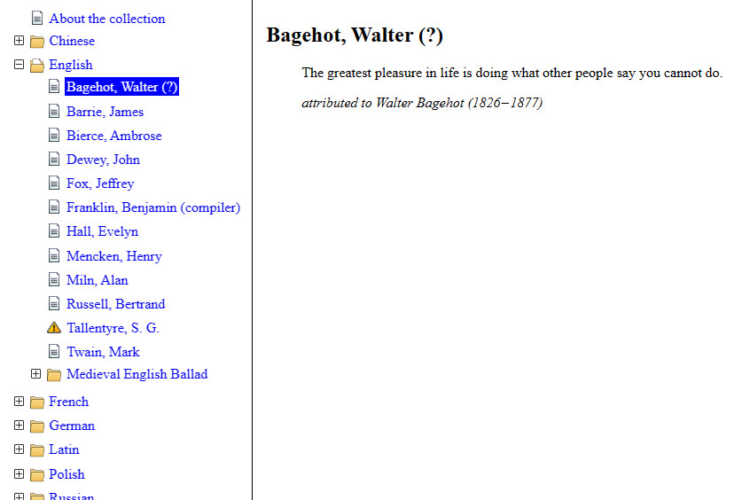

Tree of Contents (HTML + JavaScript + CSS)
==========================================

What Is It?
-----------

This is a simple JavaScript class that converts a “flat” HTML document into a tree-like form: it creates a table of contents as a tree whose nodes can be collapsed and expanded, and makes invisible the part of the document that is not referenced by the selected node. This behavior is similar to Windows help files with tree-like table of contents (`*.hlp` and `*.chm`), interactive books and so on.

The easiest way to illustrate this is with two pictures: without the script and with it (or before and after).

**A document without the table of contents:**

**The same document with the table of contents:**

> [!NOTE]
> The source code is provided *as is,* since I mainly did this project for myself, but I will be glad if someone finds it useful. Also, I physically could not test the script on a large number of browsers and especially mobile devices. Thus, I won’t mind if someone finds errors or wants to help the project in a different way.

Requirements
------------

HTML 5, ECMAScript 6, and CSS 3.0. I also used scalable SVG icons that I drew myself for the tree elements (these are included in the CSS in Base64 encoded form and placed in the `images` folder as SVG images at the same time).

I think it's possible to rewrite the code to reduce the requirements if someone needs it, but I haven't done it myself and haven't tested it on very old browsers like Internet Explorer.

How It Works?
-------------

There is a `TreeOfContents` class that is instantiated in the document `onload` event handler. An element is passed to the class constructor contains text marked up using headings of different levels (from H1 to H6). The script uses them as “milestones” to divide the text into parts and simultaneously creates a tree of these headings. The tree is built from bulleted lists `<ul>` and collapsible HTML5 elements `
` and `
` if needed. Each tree element contains a link to the corresponding part of the document, and all these parts are initially made invisible. The tree constructed in this way is placed either in an element passed to the `TreeOfContents` class constructor as the second parameter, or in an element `
` that the class creates itself if the second constructor parameter is not spacified. Clicking on a link in the tree makes the document part visible (custom `<a>` tag attributes are used for this).

### Building a Hierarchy

The main difficulty is that the HTML document actually does not have any hierarchy connecting the headings of different levels with each other and with the content of the corresponding sections. The heading is not connected in any way to the text that follows it. Therefore, the script considers the section content to be everything placed between the heading and the following heading or the end of the text. If the next heading has a lower level than the current one, then the script considers that the next heading is nested inside the current section.

To divide the document into parts, the script uses the `Range` class, which has a useful `surroundContents()` method. Without this class and its method, solving the problem would be hard because the script would have to cut out some of the content and paste it back.

> [!CAUTION]
> If the structure of the document is broken, that is, there are unclosed tags or headings are nested within other elements, the script will most likely produce strange results or not work at all.

### Levels Nesting

In any tree branch, the depth of a node's nesting is determined by the header level. The script is “smart” enough to handle situations where some header level does not exist, such as a document containing only H1, H2 and H4 headings: it treats the H4 heading as a third level rather than a fourth. Additionally, if one of the branch of the tree has a gap in the header numbering, the script inserts a “fake” tree node to maintain equal nesting levels compared to other branches.

### Internal Links (Anchors) And URLs Containing Direct Links to Parts of the Document

The tree structure gives rise to two problems at once regarding *internal links.* Firstly, if there is a link from one part of the document to another (`<a href="#element_id">`, `<a href="page.html#element_id">`, etc.), then such a link must be processed in a more complex way than usual. By default, the browser simply scrolls the document to the element with the given id, but in the case of a tree, you first need to find which section this element falls into, expand the tree branch that refers that section, show the corresponding fragment of the document, and finally allow the browser to scroll the document to the element. Secondly, if the URL contains the hash character plus the name of the element, then when loading the page the script needs to perform the same actions.

The script solves this problem this way: an additional `onclick` event listener is attached to any link with a `href` attribute that consists of either a single word peceded by a hash character (for example, `<a href="#element_id">`) or contains the URL of the current page plus a hash charater and the element id (e.g. `<a href="http://mysite.com/page.html#element_id">`). The event listener performs all the necessary actions, see the static `TreeOfContents.processHashLink()` method. And the same method is called in the class constructor if the page URL contains a hash character.

### Final Remarks

I tried to make the JS code, CSS, and HTML minimally dependent on each other. Of course, the script uses some CSS class names, but, firstly, there are not many of them, and secondly, all these names are placed at the very beginning of the script file as string constants, so they are easy to rename. And the only CSS class that is absolutely necessary is the class `hidden`, because it controls the visibility of elements (I also didn't use tricks like setting the `display` property to `none` in the script itself — I just assigned the objects the CSS class `hidden`). All other classes are intended for visual design and can easily be redefined as desired.

Known Issues / To Do
--------------------

The `TreeOfContents.#createTreeLink()` private method contains direct assignment to a link's `innerHTML` property. It seems problematic because the inner HTML of the heading element `<h…>` might contain someting inappropriate for the link `<a>`. I tried `createTextNode()`, but it doesn't works correctly if the `<h…>` contains style tags (``, `<strong>`, etc.). I also tried the `Range` object, but this idea is even worse. If anyone has any ideas, please tell me.

Another issue is related to the browser's built-in text search function on the current page (with hidden text): depending on the specific browser, it either doesn't not work at all or works incorrectly.

A Little Bonus
--------------

This is itself part of a collection of quotes in various languages that I have been collecting since the mid-2000s.

Author
------
Copyright (c) 2024, Michael Demidov

Visit my GitHub page to check for updates, report issues, etc.: https://github.com/MichaelDemidov

Drop me an e-mail at: michael.v.demidov@gmail.com
